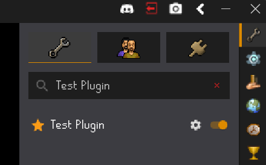

# API Access

The Kraken API which powers all of the Kraken plugins is fully open source and [available here](https://github.com/cbartram/kraken-api).
The Kraken plugins themselves are not open source for obvious reasons. More information on using the API can be found below.

# 🚀 Getting Started

Kraken API is designed to extend the RuneLite API with additional client-interaction utilities for writing automation based plugins that are compatible with RuneLite. If you are
just looking to use pre-existing plugins, you can skip this repository and head over to our website: [kraken-plugins.com](https://kraken-plugins.com).

### Prerequisites
- [Java 11+](https://adoptium.net/) (JDK required)
- [Gradle](https://gradle.org/) (wrapper included, no need to install globally)
- [Git](https://git-scm.com/)
- [RuneLite](https://runelite.net) (for testing and running plugins)


### Cloning the Repository
```bash
git clone https://github.com/cbartram/kraken-api.git
cd kraken-api
````

### Building

You can build the project with Gradle:

```bash
./gradlew clean build
```

The output API `.jar` will be located in:

```
./lib/build/libs/kraken-api-<version>.jar
```

### Consuming the API

To use the API in a project add the package to your `build.gradle` file. You will need to either:
- `export GITHUB_ACTOR=<YOUR_GITHUB_USERNAME>; export GITHUB_TOKEN=<GITHUB_PAT`
- Add the following to your `gradle.properties` file: `gpr.user=your-github-username gpr.key=your-personal-access-token`

You can generate a Github personal access token (PAT) by navigating to your [Github Settings](https://github.com/settings/personal-access-tokens)
and clicking "Generate new Token". Give the token a unique name and optional description with read-only access to public repositories. Store the token
in a safe place as it won't be viewable again. It can be used to authenticate to GitHub and pull Kraken API packages. Do **NOT** share this token with anyone.

Here is an example `build.gradle` for incorporating the API

```groovy
plugins {
    id 'java'
    id 'application'
}


// Replace with the package version of the API you need
def krakenApiVersion = 'X.Y.Z'

allprojects {
    apply plugin: 'java'
    repositories {
        // You must declare this maven repository to be able to search and pull Kraken API packages
        maven {
            name = "GitHubPackages"
            url = uri("https://maven.pkg.github.com/cbartram/kraken-api")
            credentials {
                username = project.findProperty("gpr.user") ?: System.getenv("GITHUB_ACTOR")
                password = project.findProperty("gpr.key") ?: System.getenv("GITHUB_TOKEN")
            }
        }

        // Jitpack is a legacy provider for Kraken API artifacts < 1.0.77 as well as shortest-path artifacts <= 1.0.3
        maven { url 'https://jitpack.io' }
    }
}


dependencies {
    compileOnly group: 'com.github.cbartram', name:'kraken-api', version: krakenApiVersion
    implementation group: 'com.github.cbartram', name:'shortest-path', version: '1.0.3'
    // ... other dependencies
}
```

Each release also includes a `latest` tag.
You can optionally use this instead of a semantic version for the API to use the latest published version.

> ⚠️ Be careful using `latest` in your plugins though as API functionality can change dramatically between patch versions (especially while the API is under development).
> ⚠️ If you are using the MovementService in your plugin for character pathing you should also include the `shortest-path` dependency.

### Example Plugin Setup

In order to use the API in an actual RuneLite plugin you should check out the [Kraken Example Plugin](https://github.com/cbartram/kraken-example-plugin)
which shows a best practice usage of the API within an actual plugin.
To set up your development environment we recommend following [this guide on RuneLite's Wiki](https://github.com/runelite/runelite/wiki/Building-with-IntelliJ-IDEA).

Once you have the example plugin cloned and setup within Intellij you can run the main class in `src/test/java/ExamplePluginTest.java` to run RuneLite with
the example plugin loaded in the plugin panel within RuneLite's sidebar.



### Packets & Reflection

When the API starts it will dynamically get the latest version of the Packet Utils jar file and load the plugin. This plugin
enables the API to use network packets to communicate directly with OSRS servers for an alternate way of interacting with the game client.

Most of the `Service` classes have two different methods for game interaction.
There are standard interaction methods like `interact()` and there are reflection interaction methods which will always end with `reflect`.
For example `wieldReflect()` will use reflection to wield the item instead of packets.

### API Design & Methodology

The Kraken API was designed from the ground up to leverage the software design pattern of dependency injection. This is the exact same
pattern adopted by RuneLite to ensure that plugins get exactly what they need to run from RuneLite and nothing more. As the developer you will
declare to your script what you need from the Kraken API and the dependencies will be directly injected into your script at runtime. For example a mining script
which clicks a rock may need information from the API for:

- Interacting with Game Object through the `GameObjectService`
- Checking if the inventory is full with the`InventoryService`
- Sleeping during downtime using the `SleepService`

```java
@Slf4j
public class ClickRockAction {

    @Inject
    private SleepService sleepService;
    
    @Inject
    private GameObjectService gameObjectService;
    
    @Inject
    private InventoryService inventoryService;
    

    @Subscribe
    private void onItemContainerChanged(ItemContainerChanged e) {
        if (e.getContainerId() == InventoryID.INV) {
            // ...
        }
    }
    
    public boolean performAction() {
        GameObject nearestRock = gameObjectService.findReachableObject("Iron rocks", true, 5, client.getLocalPlayer().getWorldLocation(), true, "Mine");

        if (nearestRock == null) {
            log.info("No available iron rocks found, waiting for respawn");
            return false;
        }
        
        if (gameObjectService.interact(nearestRock, "Mine")) {
            sleepService.sleepUntil(() -> context.isPlayerMining(client.getLocalPlayer()), RandomService.between(1200, 2000));
            return true;
        } else {
            return false;
        }
    }
     // ... 
}
```

Dependency injection ensures that your script classes remain lightweight, testable, and easy to debug.

### Script Structure

There are 2 main structures you can use for actually writing scripts with the Kraken API,
although, you can implement other ways of maintaining script state if you'd like!

1. Extending the basic `Script` class
2. Behavior Trees

#### Extending the Script Class

For simple plugins, most users will want to extend the `Script` class which provides helpful methods like `onStart()`, `onLoop()`, and `onEnd()` for
managing script state. You can opt to implement a Finite State Machine (FSM) pattern for your scripts where, when certain conditions are met
the script transitions to a state and performs an action. For example a mining script may have:

States:
- IDLE: Initial state, ready to begin mining
- FINDING_ROCKS: Searching for available mining rocks
- MOVING_TO_ROCKS: Walking to the selected mining location
- MINING: Actively mining ore from rocks
- INVENTORY_FULL: Inventory is full, need to bank
- MOVING_TO_BANK: Walking to the bank
- BANKING: Depositing ore into bank
- ERROR: Something went wrong, needs intervention

and governing logic like:

IDLE → FINDING_ROCKS → MOVING_TO_ROCKS → MINING → MINING → MINING →
INVENTORY_FULL → MOVING_TO_BANK → BANKING → FINDING_ROCKS → ...

This approach has several benefits:

- Clear Logic Flow: Easy to understand and debug bot behavior
- Error Handling: Structured approach to handle failures
- Maintainability: Simple to add new states or modify existing ones
- Predictable Behavior: Bot actions are deterministic based on current state
- Logging: Easy to track state transitions for debugging

Extending the `Script` class gives you a blank slate to work with,
giving your freedom to determine how your script operates with the Kraken API.

#### Behavior Trees

As you move to making more complex scripts you may run into issues with large FSM's that make managing states difficult to debug. This is where Behavior Trees come
into play. Traditionally, behavior trees have been used to give depth to A.I. enemies in video games, however, the Kraken API includes a foundation for creating
scripts using Behavior Trees. This document won't cover the mechanics behind behavior trees in detail however, you can check out the [Kraken Example Mining Plugin](https://github.com/cbartram/kraken-example-plugin)
to see a fully implemented example of a Behavior tree based script.

Behavior trees are one of those things where you don't need them until you do. You may eventually get to a point in your script where the state transitions
become too complex and unwieldy to maintain which is why the Kraken API provides this programming paradigm to you!

### Running Tests

Run the full test suite with:

```bash
./gradlew test
```

### Development Workflow

1. Create a new branch from `master`
2. Implement or update your plugin/feature for the API
3. Add tests for new functionality
4. Run `./gradlew build` to verify that the API builds and tests pass
5. Commit your changes with a clear message `git commit -m "feat(api): Add feature X to Kraken API"`
6. Open a Pull Request

## Deployment

The Kraken API is automatically built and deployed via GitHub actions on every push to the `master` branch.
The latest version can be found in the [releases](https://github.com/cbartram/kraken-api/releases) section of the repository.

A deployment consists of:

- Building the API JAR
- Publishing a new version to the GitHub Releases section
    - This will be picked up by Github Packages for easy integration into other gradle projects.
- Uploading the JAR file to the Minio storage server used by the Kraken Client at runtime.
- (Optional) Updating the `bootstrap.json` in the Kraken Client to point to the latest version of the API JAR file
- (Optional) Updating the build.gradle file in the Kraken Client to use the latest version of the API JAR file

## 🛠 Built With

* [Java](https://www.java.org/) — Core language
* [Gradle](https://gradle.org/) — Build tool
* [RuneLite](https://runelite.net) — Used for as the backbone for the API

## 🔖 Versioning

We use [Semantic Versioning](http://semver.org/).
See the [tags on this repository](https://github.com/cbartram/kraken-api/tags) for available releases.