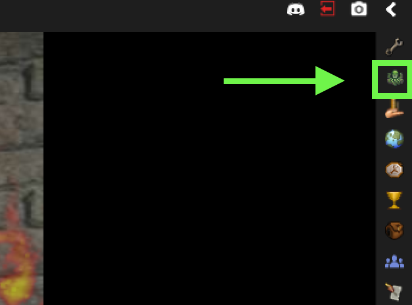
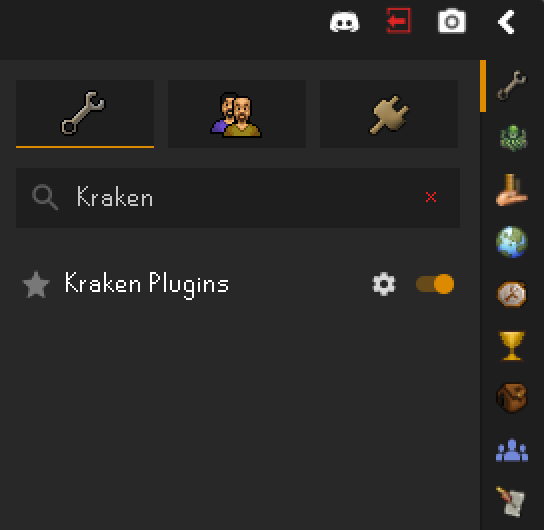
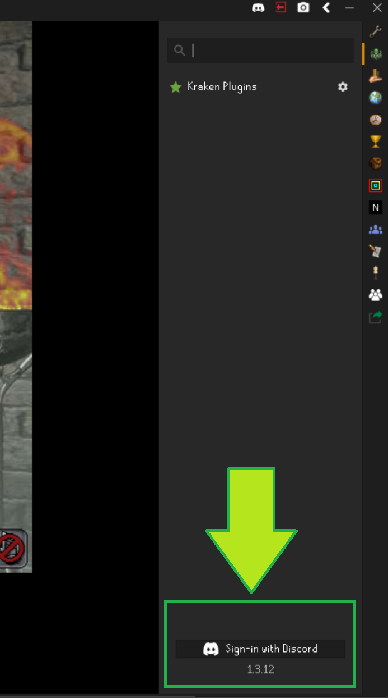
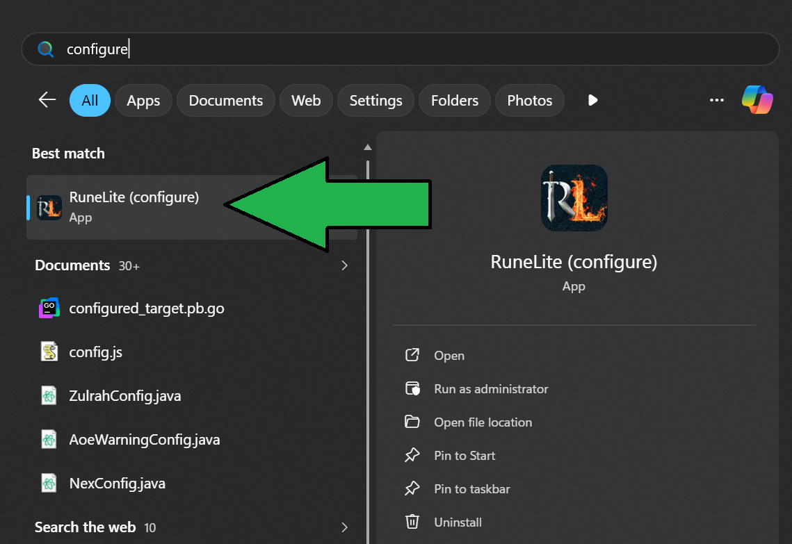
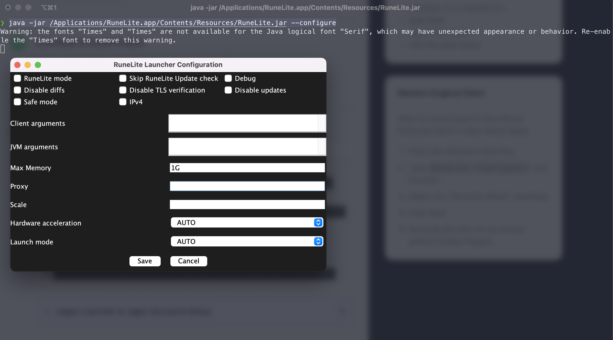

# Configuration

You can validate that your Kraken Plugins Client installation worked correctly be checking to see that the Kraken
logo appears in the sidebar of your client.

If the Kraken icon is not appearing in your sidebar check your normal RuneLite plugins for the plugin called `Kraken Plugins`.
If this plugin is disabled, enable it. You should now see the Kraken icon in your RuneLite sidebar.

The Kraken client has several configuration options namely:

- Skip Hook Load
- Skip Packet Load
- Debug Logs

Skip Hook load will skip loading a JSON file with references to client classes invoked using reflection. In english: 
"Don't load data I need to click things in the game.", ultimately this means that plugins which use automation like:
prayer flicking, gear swapping, spell casting, etc... will not function. Generally this option is here in case 
some type of game update occurs which doesn't break the game client but does break automation within Kraken.

Skip Packet Load is similar to skipping the hook load in that it will skip loading and registering a RuneLite plugin which
enables the use of packets within plugins. Packets send data directly to game servers rather than having to actually use a mouse
to interact with the canvas or reflection to invoke a client method. 

Finally debug logs will print Kraken debug logs when outputting to the RuneLite logs folder. This can give some more insight into
what is going wrong when launching the client or using plugins. 

> :warning: If the client fails to load it's likely due to a game update. Checking these options may help get the client to load
> but generally **WILL NOT** and you'll have to wait for a Kraken update to play with the plugins again.

## Signing In

When you first launch the client you will see a "Sign in with Discord" button in the Kraken sidebar. Clicking this 
button will open up a new page in your web browser and grant Kraken access to view a few properties on your Discord account
and sign you into the client. Signing in to the client is generally a one time process unless you use multiple discord
account with Krakens although, this is **NOT** recommended.

## Account Linking

It is **VERY** important that you sign in to the same discord account on both the website and the client. When purchasing plugins on the website
your plugins will be associated with the discord account you are currently logged in with. If you sign in to a different discord account on the client
your plugins will **NEVER** show up for you.

Your discord account is the common element between the website and the client so please use the same Discord account when signing
into both the website and the client!

# Launcher Configuration

When RuneLite opens it uses a separate launcher program which will grab the latest version of RuneLite and its dependencies before 
launching the client process. This ensures that RuneLite is able to update regularly behind the scenes and ensures users
don't have to constantly re-download the latest client.

Because Kraken is built directly on top of RuneLite it is able to hook into this launcher process so you don't have to 
constantly update Kraken or its dependencies! This also allows Kraken to expose some nifty features like:

- RuneLite mode
- Update Hooks
- Proxies

See [launcher configuration](launcher-configuration.md) for more detailed information on each of these features.

## Windows

To configure the launcher on windows press your start key and search for "RuneLite (Configure)" and press enter. This
will launch a window where you can configure options for how RuneLite and Kraken start. See more information about
each of these [options here](launcher-configuration.md)

## Mac

Configuring the launcher is a little trickier on MacOS. Open up a new "Terminal" window by hitting Command + Spacebar and
searching for "Terminal". Copy and paste the following line to launch the configuration window:

`java -jar /Applications/RuneLite.app/Contents/Resources/RuneLite.jar --configure`

You should see a new window popup with RuneLite & Kraken configuration options. 
See more information about each of these [options here](launcher-configuration.md)

# Proxy Configuration

The Kraken Launcher supports SOCKS5 proxies. For more information on setting up proxies view our [proxy documentation](proxy.md).

# Plugin Configuration

Kraken Plugins work just like normal RuneLite plugins you can configure them by clicking the "Cog" icon and tweaking
various settings for each plugin.