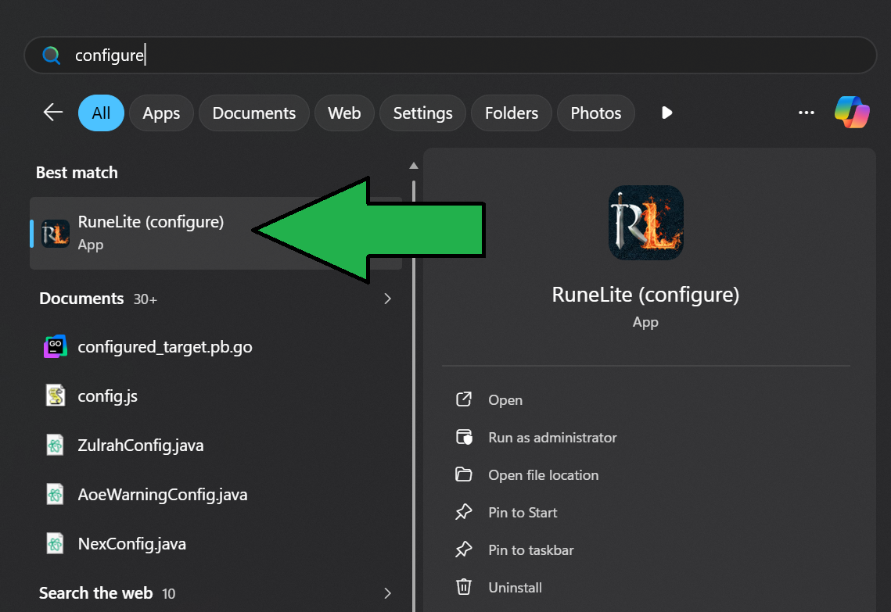

# Downloading the Client

To download the Kraken client:

- Sign in to [Kraken Plugins](https://kraken-plugins.com) with discord
- Visit the ["Download Client"](https://kraken-plugins.com/download) page
- Select your operating system either Windows or Mac
- Click "Download Client"

## Installation

The following sections will walk you through installing the client on your computer so you can launch Old School RuneScape
and use the Kraken plugins.

### Windows

If you are on Windows double-click the executable (`.exe`) file that was downloaded and run through the installation process to install the client 
to your RuneLite directory. The installer will take care of setting everything up for you and Kraken plugins will now load alongside
RuneLite. 

You can launch RuneLite as you normally would through either the Jagex Launcher or Desktop Icon.

### Mac

- Download the `KrakenSetup.jar` file from [the website](https://kraken-plugins.com/download)
- Double click the JAR file to start the launcher installation process
- Sometimes MacOS security may warn you about unidentified developer apps
  - Open `System Preferences > Security & Privacy > General Tab`
  - Click "Open Anyway" or "Allow Anyway"
- Your Kraken launcher will be installed and you should see a popup message

Launch RuneLite as normal through your Applications or the Jagex Launcher

## Next Steps

See our [configuration](configuration.md) document for information on how to sign into the client, load, and configure your plugins!