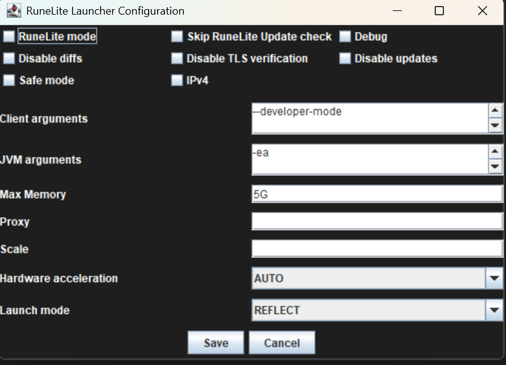

# Launcher Configuration Options

This document covers the various launcher configuration options which are present and what each option does. You
are free to modify or change any of these options at any time.

| **Option Name**            | **Description**                                                                                                                                                                                                                                                     | **Type**   | **Example**                                               |
|----------------------------|---------------------------------------------------------------------------------------------------------------------------------------------------------------------------------------------------------------------------------------------------------------------|------------|-----------------------------------------------------------|
| RuneLite Mode              | Disables all Kraken dependency and external plugin loading and loads RuneLite 100% normally.                                                                                                                                                                        | True/False | N/A                                                       |
| Skip RuneLite Update Check | Kraken developers check each RuneLite update for code which could expose the client.  This takes time and so the client isn't immediately available after an update.  By checking this box you skip this safety check by developers and load Kraken plugins anyway. | True/False | N/A                                                       |
| Debug                      | Prints debug log messages in the console and saves them to the RuneLite logs folder.                                                                                                                                                                                | True/False | N/A                                                       |
| Disable Diffs              | Download full JAR files for plugin and dependency updates instead of just the diffs.                                                                                                                                                                                | True/False | N/A                                                       |
| Disable TLS Verification   | RuneLite and Kraken make several HTTP calls to retrieve files over TLS/SSL ensuring the traffic is encrypted end to end.  This option will disable the verification of these endpoints. Usually this comes in handy with strict proxies.                            | True/False | N/A                                                       |
| Disable Updates            | Prevents RuneLite from updating. You will not be able to play without running the latest version of RuneLite                                                                                                                                                        | True/False | N/A                                                       |
| Safe Mode                  | Runs RuneLite in safe mode loading only plugins that come pre-installed from the client. External plugins from the Plugin Hub will not be loaded. Kraken plugins will still be loaded.                                                                              | True/False | N/A                                                       |
| IPv4                       | Prefers IPV4 of IPV6                                                                                                                                                                                                                                                | True/False | N/A                                                       |
| Client Arguments           | Custom Client arguments that are passed directly to the RuneLite client. You can find RuneLite client arguments to pass [here](https://github.com/runelite/runelite/blob/master/runelite-client/src/main/java/net/runelite/client/RuneLite.java#L177).              | String     | `--developer-mode --disable-telemetry --profile myplayer` |
| JVM Arguments              | Args passed directly to the Java virtual machine. These are generally used to control how much memory RuneLite has to work with.                                                                                                                                    | String     | `-Xms256m -Xmx2048m`                                      |
| Max Memory                 | The max memory in GB that RuneLite will use                                                                                                                                                                                                                         | String     | `5G`                                                      |
| Proxy                      | A proxy to use for the client. This is a SOCKS5 proxy which will proxy all network communication between the RuneLite client and Jagex servers. This should be in the format `ip:port` or `ip:port:user:pass`                                                       | String     | 192.123.456.81:5555                                       |
| Scale                      | A scaling factor for Java 2D                                                                                                                                                                                                                                        | Double     | 1.0                                                       |
| Hardware Acceleration      | Hardware Acceleration library to use for Java2D                                                                                                                                                                                                                     | Select     | Auto, Off, DirectDraw, OpenGL, Metal                      |
| Launch Mode                | Determines the way the client is launched either with a forked process, reflection, or via the JVM. This is overriden by Kraken to always use reflection so this option will not do anything.                                                                       | Select     | JVM, FORK, REFLECT                                        |
