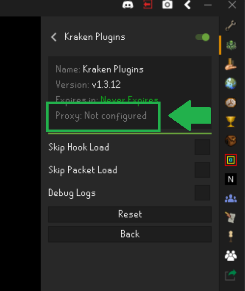

# Proxies

The Kraken launcher support SOCKS5 proxies. If you are unfamiliar with what a proxy is, a proxy is simply an intermediate machine
which accepts internet traffic from one machine and forward the traffic to another machine. Proxies for RuneLite and Kraken are primarily used for concealing IP and location
information from Jagex.

For example if I wanted to pretend I was in Russia, I could purchase a proxy in Russia and configure Kraken to send all my RuneLite client traffic through
the Russian computer before it reached Jagex's servers. When Jagex see's my connection it will appear as though I am on 
vacation is Russia (or at least that's the general idea)!

To configure a proxy for Kraken open the launcher configuration window and in the proxy field enter your ip and port.
For example `192.168.50.13:4355`. Kraken also supports proxies with authentication. Simply add a user and password to the end of
your proxy string: `192.168.50.13:5555:user:password` to enable proxy authentication.

## Verifying the Proxy

You can verify that the proxy is active and working by checking the configuration of the `Kraken Plugins` plugin. Your
current proxy settings will be shown in the plugin header if they are set.

## Recommended Proxies

Typically, we would always advise individuals to source their own proxies as it will be the safest and least used.
However,if you're unsure where to buy a proxy from, here are some suggestions (we are not affiliated with any of the following
proxy companies and do not endorse their product, they are just options to let you know what to look for):

- [Ace Proxies](https://www.aceproxies.com/)
- [IPRoyal](https://iproyal.com/)

When purchasing a proxy, please ensure it is IPv4 `SOCKS5`, we do not support other proxies such as HTTP.