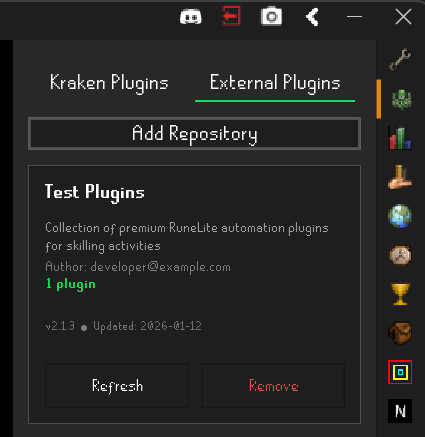
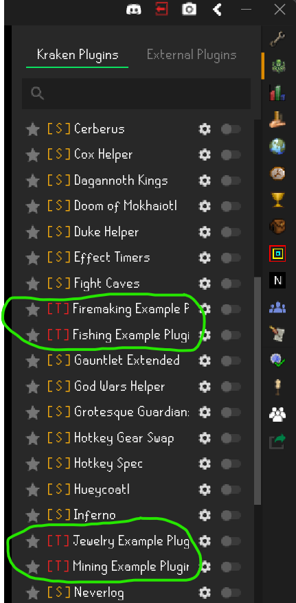
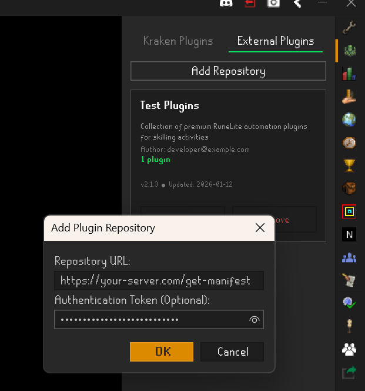

# External Plugins

External plugins are third party plugins developed using both the Kraken and RuneLite API's which run natively
on Kraken's client. This functionality enables the Kraken client to function as a platform enabling developers to
use the [open source API](https://github.com/cbartram/kraken-api) to create plugins for the client. 

External plugins in Kraken function very similarly to exteral plugins in RuneLite. This document covers both how
to use the Kraken external plugin system and how to create and share external plugins.

> **Note:** External plugins differ from sideloaded plugins in that they do not expose JAR files and are loaded
> directly from the Kraken client.

## Using External Plugins

External plugins are loaded from "repositories". Repositories are simply directories on remote servers which
store and serve RuneLite plugin JAR files. Adding a repository in the Kraken client will load all plugins associated
with that repository. To add a repository, navigate to the Kraken plugin in the sidebar and click the "External Plugins" tab. From
there, click the "Add Repository" button and enter the URL of the repository. 


Sometimes, repositories can be private and require authentication. Repository developers will need to provide you an authentication
token **they generate** to authenticate with their repository and load the plugins.

Once you add a repository, you will see a list of plugins in your Kraken client plugins list which belong to the loaded
repository.




You will see the loaded plugins with the first letter of the repository they belong to in your list of plugins:



# External Plugin Development

The rest of this document covers how to create, sell, and host external plugin repositories.

## Repository Manifest

Plugin repositories require a manifest file that contains repository metadata and specifies where the Kraken client can retrieve plugins.
Manifest files are JSON and have the following format: 

```json
{
  "repository": {
    "id": "a-unique-id-for-your-repository",
    "name": "Your Plugins",
    "version": "2.1.3",
    "author": "developer@example.com",
    "description": "Collection of premium RuneLite automation plugins for skilling activities",
    "website": "https://your-website.com/a-list-of-plugins",
    "lastUpdated": "2026-01-12T00:00:00Z"
  },
  "plugins": [
    {
      "name": "Auto Fisher",
      "version": "1.0.0",
      "artifact": {
        "url": "http://your-website.com/plugins/auto-fisher-1.0.0.jar",
        "sha256": "479efaf92702366206884efdcf787155586971905a59ab1f"
      }
    },
    ... 
  ]
}
```

When the Kraken client loads an external repository from a manifest file, **ALL PLUGINS** listed in the repository will be loaded. 
Because of this, we recommend having a 1:1 relationship between manifest files and plugin users. This ensures that users who purchase your plugins
each get their own unique manifest file containing only the plugins they have purchased (rather than your whole suite of plugins).

### Manifest Updates

After a user adds your repository, your manifest will be fetched at client runtime. Your manifest file is never persisted to disk however, the details to fetch
your manifest (i.e. URL and Auth token) are encrypted on the users' local machine. Users can refresh their manifest from your server (making another `GET`
request) **at will** so it's recommended to implement some form of rate limiting on your server. 

Manifests are refreshed **automatically** on each client load. This means that if you need to add, update, or remove plugins for a user, all you need to do 
is update your manifest file for the user on your server. The next time the user manually refreshes the manifest or restarts their client, they will get
your updates.

### Manifest Error Handling

If your server returns an invalid (non 200 status code) response or fails to respond within the timeout (3 seconds) users will be given a dialogue popup offering
them a choice to remove your repository. None of the repository plugins will load, nor will your repositories card show up in the UI. 

If a user selects "Yes" to remove your repository, then they will need to re-add it in the future with the `Add Repository` button.

## Authentication

The Kraken Client's external plugin system loads both manifests and plugins over HTTP and supports token-based authentication mechanisms which
are specified in the `Authorization` HTTP header. Token values will be sent to your server prefixed with `Bearer` and a space as is standard
for the HTTP/HTTPS protocol. For example:

```json
{
  "Authorization": "Bearer <your token>"
}
```

Kraken will make an HTTP `GET` request to the URL provided to your user using your token in the `Authorization` header field and passing a `kraken-client` user agent header. The client expects
to receive a JSON UTF-8 encoded string response containing the manifest. For example, in the following screenshot, the Kraken client will make the following curl request to retrieve the manifest:

1

```shell
curl "https://your-server.com/get-manifest" \
     -H "Authorization: Bearer somerandomtoken123" \
     -H "User-Agent: Kraken-Client"
```

Subsequent requests to retrieve the plugins specified in the manifest will include the same `User-Agent` and `Authorization` headers and will also be `GET` requests. You will likely need
to identify the Kraken user making the request to retrieve and provide the right manifest from your database (the manifest containing the plugins user `X` has purchased).

To do this, we recommend either:

- Providing the user with a URL encoding their user id in the URL when they add a repository i.e., Thanks for purchasing our plugin, to run our plugin on the Kraken client, add a repository with this url: `https://my-server.com/get-manifest?userId=abc123`
- Encoding the user ID directly in the payload of a [JWT](https://www.jwt.io/) token in the Authorization header. i.e., Thanks for purchasing our plugin, to run our plugin on the Kraken client, paste this token in the authorization field when adding a new repository:
  `eyJhkpXVCJ9.eyJzdWIiOinMiGM6H9FNFUROf3wh7SmqJp-QV30`

> **Note** If your manifest and plugin jar files are served publicly and no authentication is necessary, then you may instruct your users to leave the "Authentication" field
blank when adding a new repository.

## Plugin Hosting & Server Setup

Kraken external plugins are always loaded over HTTP/HTTPS. Kraken will **NOT** host your plugin jar files or write the contents of your JAR files
to disk after they have been loaded. This means your plugins stay in memory for the duration of the RuneLite client's session, AND you are responsible
for ensuring your plugin JAR files are available over the internet (either with or without authentication).

The Kraken client doesn't make any assumptions about your backend, programming language, or how you choose to serve your plugin jar artifacts. 

You can use:
- S3
- GitHub (public or private). You should use a GitHub PAT for authentication to private repos
- Minio
- Your own statically hosted files
- Anything other way you can think of to serve JAR files

To host your plugin and manifest files provided that they can be accessed via an HTTP/HTTPS `GET` request documented above.

**Please ensure you return a byte array response for your JAR contents (see examples below) with the `Content-Type: application/octet-stream` header set when
returning a response for your plugin JAR artifacts.**

## Examples

The following examples show how you can set up a Kraken client-compatible server for serving your plugins and manifests.

### Java

```java
@Slf4j
public class ExampleHttpServer {

    private static String authToken = null;

    static void main(String[] args) throws IOException {
        int port = args.length > 0 ? Integer.parseInt(args[0]) : 8080;
        authToken = args.length > 1 ? args[1] : null;

        HttpServer server = HttpServer.create(new InetSocketAddress(port), 0);

        server.createContext("/get-manifest", new ManifestHandler());
        server.createContext("/plugins/", new PluginHandler());
        server.createContext("/", new RootHandler());

        server.setExecutor(null);
        server.start();

        log.info("Example HTTP server started on port {}", port);
        log.info("Auth token: {}", authToken != null ? authToken : "NONE (public access)");
        log.info("Endpoints:");
        log.info("  GET http://localhost:{}/get-manifest", port);
        log.info("  GET http://localhost:{}/plugins/test-plugin.jar", port);
        log.info("Press Ctrl+C to stop");
    }

    static class ManifestHandler implements HttpHandler {

        private String manifest;

        public ManifestHandler() {
            try (InputStream json = getClass().getResourceAsStream("/kraken-manifest-http.json")) {
                if(json == null) {
                    log.error("Failed to find or load kraken-manifest.json file - using empty default");
                    this.manifest = "{}";
                    return;
                }

                this.manifest = new String(json.readAllBytes(), StandardCharsets.UTF_8);
            } catch (IOException e) {
                log.error("Failed to read manifest file", e);
                this.manifest = "{}";
            }
        }

        @Override
        public void handle(HttpExchange exchange) throws IOException {
            if (!"GET".equals(exchange.getRequestMethod())) {
                sendResponse(exchange, 405, "Method not allowed");
                return;
            }

            if (!checkAuth(exchange)) {
                sendResponse(exchange, 401, "Unauthorized");
                return;
            }

            log.info("Serving manifest");
            exchange.getResponseHeaders().set("Content-Type", "application/json");

            String responseBody = this.manifest != null ? this.manifest : "{}";
            sendResponse(exchange, 200, responseBody);
        }
    }

    static class PluginHandler implements HttpHandler {

        private byte[] jar;

        public PluginHandler() {
            try(InputStream json = getClass().getResourceAsStream("/test-plugin.jar")) {
                if(json == null) {
                    log.error("Failed to find or load fishing plugin jar file");
                    this.jar = new byte[]{};
                    return;
                }

                this.jar = json.readAllBytes();
            } catch (IOException e) {
                log.error("Failed to read fishing plugin jar file from test resources ");
                this.jar = new byte[]{};
            }
        }

        @Override
        public void handle(HttpExchange exchange) throws IOException {
            if (!"GET".equals(exchange.getRequestMethod())) {
                sendResponse(exchange, 405, "Method not allowed");
                return;
            }

            if (!checkAuth(exchange)) {
                sendResponse(exchange, 401, "Unauthorized");
                return;
            }

            String path = exchange.getRequestURI().getPath();
            String filename = path.substring(path.lastIndexOf('/') + 1);

            // This always loads /test-plugin.jar, but you get the idea
            log.info("Serving plugin: {}", filename);
            exchange.getResponseHeaders().set("Content-Type", "application/octet-stream");
            sendResponse(exchange, 200, this.jar);
        }
    }

    static class RootHandler implements HttpHandler {
        @Override
        public void handle(HttpExchange exchange) throws IOException {
            String response = "Example HTTP Server\n\nAvailable endpoints:\n" +
                    "  GET /get-manifest.json\n" +
                    "  GET /plugins/{filename}.jar\n";
            sendResponse(exchange, 200, response);
        }
    }

    // TODO You should definitely use an Auth provider like Cognito, Firebase, OAuth etc... for this. This
    // is just an example
    private static boolean checkAuth(HttpExchange exchange) {
        if (authToken == null) {
            return true; // No auth required
        }

        String auth = exchange.getRequestHeaders().getFirst("Authorization");
        if (auth == null) {
            log.warn("Missing Authorization header");
            return false;
        }

        if (auth.startsWith("Bearer ")) {
            String token = auth.substring(7);
            if (authToken.equals(token)) {
                return true;
            }
            log.warn("Invalid token provided");
        }

        return false;
    }

    private static void sendResponse(HttpExchange exchange, int status, String body) throws IOException {
        // UTF-8 Encoded string response for the manifest
        byte[] bytes = body.getBytes(StandardCharsets.UTF_8);
        exchange.sendResponseHeaders(status, bytes.length);
        try (OutputStream os = exchange.getResponseBody()) {
            os.write(bytes);
        }
    }

    private static void sendResponse(HttpExchange exchange, int status, byte[] body) throws IOException {
        // Byte array response with the octet-stream header set for the plugin JAR file
        exchange.sendResponseHeaders(status, body.length);
        try (OutputStream os = exchange.getResponseBody()) {
            os.write(body);
        }
    }
}
```

### Python

```python
import logging
import sys
from http.server import HTTPServer, BaseHTTPRequestHandler
from pathlib import Path
import json

logging.basicConfig(
    level=logging.INFO,
    format='%(asctime)s - %(levelname)s - %(message)s'
)
log = logging.getLogger(__name__)


class ExampleHttpServer:
    auth_token = None

    @staticmethod
    def main():
        port = int(sys.argv[1]) if len(sys.argv) > 1 else 8080
        ExampleHttpServer.auth_token = sys.argv[2] if len(sys.argv) > 2 else None

        log.info(f"Example HTTP server started on port {port}")
        log.info(f"Auth token: {ExampleHttpServer.auth_token if ExampleHttpServer.auth_token else 'NONE (public access)'}")
        log.info("Endpoints:")
        log.info(f"  GET http://localhost:{port}/get-manifest")
        log.info(f"  GET http://localhost:{port}/plugins/test-plugin.jar")
        log.info("Press Ctrl+C to stop")

        server = HTTPServer(('', port), RequestHandler)
        try:
            server.serve_forever()
        except KeyboardInterrupt:
            log.info("Server stopped")
            server.shutdown()


class RequestHandler(BaseHTTPRequestHandler):
    manifest_data = None
    plugin_jar = None

    @classmethod
    def load_resources(cls):
        """Load manifest and plugin JAR on first request"""
        if cls.manifest_data is None:
            try:
                manifest_path = Path(__file__).parent / 'kraken-manifest.json'
                if manifest_path.exists():
                    with open(manifest_path, 'r', encoding='utf-8') as f:
                        cls.manifest_data = f.read()
                else:
                    log.error("Failed to find or load kraken-manifest.json file - using empty default")
                    cls.manifest_data = "{}"
            except Exception as e:
                log.error(f"Failed to read manifest file: {e}")
                cls.manifest_data = "{}"

        if cls.plugin_jar is None:
            try:
                jar_path = Path(__file__).parent / 'test-plugin.jar'
                if jar_path.exists():
                    with open(jar_path, 'rb') as f:
                        cls.plugin_jar = f.read()
                else:
                    log.error("Failed to find or load plugin jar file")
                    cls.plugin_jar = b''
            except Exception as e:
                log.error(f"Failed to read plugin jar file from test resources: {e}")
                cls.plugin_jar = b''

    def check_auth(self):
        """Check authorization header if auth token is set"""
        if ExampleHttpServer.auth_token is None:
            return True  # No auth required

        auth = self.headers.get('Authorization')
        if auth is None:
            log.warning("Missing Authorization header")
            return False

        if auth.startswith("Bearer "):
            token = auth[7:]
            if ExampleHttpServer.auth_token == token:
                return True
            log.warning("Invalid token provided")

        return False

    def send_text_response(self, status, body):
        """Send UTF-8 encoded string response"""
        bytes_body = body.encode('utf-8')
        self.send_response(status)
        self.send_header('Content-Length', len(bytes_body))
        self.end_headers()
        self.wfile.write(bytes_body)

    def send_binary_response(self, status, body):
        """Send binary response"""
        self.send_response(status)
        self.send_header('Content-Length', len(body))
        self.end_headers()
        self.wfile.write(body)

    def do_GET(self):
        """Handle GET requests"""
        self.load_resources()

        if self.path == '/get-manifest':
            self.handle_manifest()
        elif self.path.startswith('/plugins/'):
            self.handle_plugin()
        elif self.path == '/':
            self.handle_root()
        else:
            self.send_text_response(404, "Not found")

    def handle_manifest(self):
        """Handle manifest endpoint"""
        if not self.check_auth():
            self.send_text_response(401, "Unauthorized")
            return

        log.info("Serving manifest")
        self.send_response(200)
        self.send_header('Content-Type', 'application/json')
        self.send_header('Content-Length', len(self.manifest_data.encode('utf-8')))
        self.end_headers()
        self.wfile.write(self.manifest_data.encode('utf-8'))

    def handle_plugin(self):
        """Handle plugin endpoint"""
        if not self.check_auth():
            self.send_text_response(401, "Unauthorized")
            return

        filename = self.path.split('/')[-1]
        
        # This always loads test-plugin.jar, but you get the idea
        log.info(f"Serving plugin: {filename}")
        self.send_response(200)
        self.send_header('Content-Type', 'application/octet-stream')
        self.send_header('Content-Length', len(self.plugin_jar))
        self.end_headers()
        self.wfile.write(self.plugin_jar)

    def handle_root(self):
        """Handle root endpoint"""
        response = ("Example HTTP Server\n\nAvailable endpoints:\n"
                   "  GET /get-manifest.json\n"
                   "  GET /plugins/{filename}.jar\n")
        self.send_text_response(200, response)

    def log_message(self, format, *args):
        """Override to suppress default logging"""
        pass


if __name__ == "__main__":
    ExampleHttpServer.main()
```

### Golang

```go
package main

import (
	"fmt"
	"io"
	"log"
	"net/http"
	"os"
	"path/filepath"
	"strings"
	"time"
)

var (
	authToken    string
	manifestData []byte
	pluginJar    []byte
)

func main() {
	port := "8080"
	if len(os.Args) > 1 {
		port = os.Args[1]
	}
	if len(os.Args) > 2 {
		authToken = os.Args[2]
	}

	log.SetFlags(log.Ldate | log.Ltime)

	log.Printf("Example HTTP server started on port %s", port)
	if authToken != "" {
		log.Printf("Auth token: %s", authToken)
	} else {
		log.Println("Auth token: NONE (public access)")
	}
	log.Println("Endpoints:")
	log.Printf("  GET http://localhost:%s/get-manifest", port)
	log.Printf("  GET http://localhost:%s/plugins/test-plugin.jar", port)
	log.Println("Press Ctrl+C to stop")

	// Load resources
	loadResources()

	// Set up routes
	http.HandleFunc("/get-manifest", handleManifest)
	http.HandleFunc("/plugins/", handlePlugin)
	http.HandleFunc("/", handleRoot)

	// Start server
	addr := ":" + port
	if err := http.ListenAndServe(addr, nil); err != nil {
		log.Fatalf("Server error: %v", err)
	}
}

func loadResources() {
	// Load manifest
	execPath, err := os.Executable()
	if err != nil {
		log.Printf("Failed to get executable path: %v", err)
		execPath = "."
	}
	execDir := filepath.Dir(execPath)

	manifestPath := filepath.Join(execDir, "kraken-manifest-http.json")
	data, err := os.ReadFile(manifestPath)
	if err != nil {
		log.Printf("Failed to find or load kraken-manifest.json file - using empty default: %v", err)
		manifestData = []byte("{}")
	} else {
		manifestData = data
	}

	// Load plugin JAR
	jarPath := filepath.Join(execDir, "test-plugin.jar")
	data, err = os.ReadFile(jarPath)
	if err != nil {
		log.Printf("Failed to find or load fishing plugin jar file: %v", err)
		pluginJar = []byte{}
	} else {
		pluginJar = data
	}
}

func checkAuth(r *http.Request) bool {
	if authToken == "" {
		return true // No auth required
	}

	auth := r.Header.Get("Authorization")
	if auth == "" {
		log.Println("Missing Authorization header")
		return false
	}

	if strings.HasPrefix(auth, "Bearer ") {
		token := auth[7:]
		if token == authToken {
			return true
		}
		log.Println("Invalid token provided")
	}

	return false
}

func handleManifest(w http.ResponseWriter, r *http.Request) {
	if r.Method != http.MethodGet {
		http.Error(w, "Method not allowed", http.StatusMethodNotAllowed)
		return
	}

	if !checkAuth(r) {
		http.Error(w, "Unauthorized", http.StatusUnauthorized)
		return
	}

	log.Println("Serving manifest")
	w.Header().Set("Content-Type", "application/json")
	w.Header().Set("Content-Length", fmt.Sprintf("%d", len(manifestData)))
	w.WriteHeader(http.StatusOK)
	w.Write(manifestData)
}

func handlePlugin(w http.ResponseWriter, r *http.Request) {
	if r.Method != http.MethodGet {
		http.Error(w, "Method not allowed", http.StatusMethodNotAllowed)
		return
	}

	if !checkAuth(r) {
		http.Error(w, "Unauthorized", http.StatusUnauthorized)
		return
	}

	filename := filepath.Base(r.URL.Path)

	// This always loads test-plugin.jar, but you get the idea
	log.Printf("Serving plugin: %s", filename)
	w.Header().Set("Content-Type", "application/octet-stream")
	w.Header().Set("Content-Length", fmt.Sprintf("%d", len(pluginJar)))
	w.WriteHeader(http.StatusOK)
	w.Write(pluginJar)
}

func handleRoot(w http.ResponseWriter, r *http.Request) {
	if r.URL.Path != "/" {
		http.Error(w, "Not found", http.StatusNotFound)
		return
	}

	response := "Example HTTP Server\n\nAvailable endpoints:\n" +
		"  GET /get-manifest.json\n" +
		"  GET /plugins/{filename}.jar\n"

	w.Header().Set("Content-Type", "text/plain")
	w.WriteHeader(http.StatusOK)
	io.WriteString(w, response)
}
```

### Node.js (Javascript)

```javascript
const http = require('http');
const fs = require('fs');
const path = require('path');

let authToken = null;

class ManifestHandler {
  constructor() {
    try {
      const manifestPath = path.join(__dirname, 'kraken-manifest-http.json');
      this.manifest = fs.readFileSync(manifestPath, 'utf8');
    } catch (error) {
      console.error('Failed to find or load kraken-manifest.json file - using empty default', error);
      this.manifest = '{}';
    }
  }

  handle(req, res) {
    if (req.method !== 'GET') {
      sendResponse(res, 405, 'Method not allowed');
      return;
    }

    if (!checkAuth(req)) {
      sendResponse(res, 401, 'Unauthorized');
      return;
    }

    console.log('Serving manifest');
    res.setHeader('Content-Type', 'application/json');
    sendResponse(res, 200, this.manifest || '{}');
  }
}

class PluginHandler {
  constructor() {
    try {
      const jarPath = path.join(__dirname, 'test-plugin.jar');
      this.jar = fs.readFileSync(jarPath);
    } catch (error) {
      console.error('Failed to find or load fishing plugin jar file', error);
      this.jar = Buffer.alloc(0);
    }
  }

  handle(req, res) {
    if (req.method !== 'GET') {
      sendResponse(res, 405, 'Method not allowed');
      return;
    }

    if (!checkAuth(req)) {
      sendResponse(res, 401, 'Unauthorized');
      return;
    }

    const urlPath = req.url;
    const filename = urlPath.substring(urlPath.lastIndexOf('/') + 1);

    console.log(`Serving plugin: ${filename}`);
    res.setHeader('Content-Type', 'application/octet-stream');
    sendResponseBytes(res, 200, this.jar);
  }
}

class RootHandler {
  handle(req, res) {
    const response = `Kraken Test HTTP Server

Available endpoints:
  GET /get-manifest
  GET /plugins/{filename}.jar
`;
    sendResponse(res, 200, response);
  }
}

function checkAuth(req) {
  if (authToken === null) {
    return true; // No auth required
  }

  const auth = req.headers['authorization'];
  if (!auth) {
    console.warn('Missing Authorization header');
    return false;
  }

  if (auth.startsWith('Bearer ')) {
    const token = auth.substring(7);
    if (authToken === token) {
      return true;
    }
    console.warn('Invalid token provided');
  }

  return false;
}

function sendResponse(res, status, body) {
  const bytes = Buffer.from(body, 'utf8');
  res.writeHead(status, { 'Content-Length': bytes.length });
  res.end(bytes);
}

function sendResponseBytes(res, status, body) {
  res.writeHead(status, { 'Content-Length': body.length });
  res.end(body);
}

function main() {
  const args = process.argv.slice(2);
  const port = args.length > 0 ? parseInt(args[0]) : 8080;
  authToken = args.length > 1 ? args[1] : null;

  const manifestHandler = new ManifestHandler();
  const pluginHandler = new PluginHandler();
  const rootHandler = new RootHandler();

  const server = http.createServer((req, res) => {
    const url = req.url;

    if (url === '/get-manifest') {
      manifestHandler.handle(req, res);
    } else if (url.startsWith('/plugins/')) {
      pluginHandler.handle(req, res);
    } else {
      rootHandler.handle(req, res);
    }
  });

  server.listen(port, () => {
    console.log(`Test HTTP server started on port ${port}`);
    console.log(`Auth token: ${authToken !== null ? authToken : 'NONE (public access)'}`);
    console.log('Endpoints:');
    console.log(`  GET http://localhost:${port}/get-manifest`);
    console.log(`  GET http://localhost:${port}/plugins/test-plugin.jar`);
    console.log('Press Ctrl+C to stop');
  });
}

main();
```
