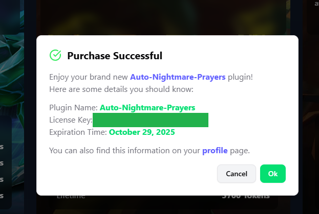
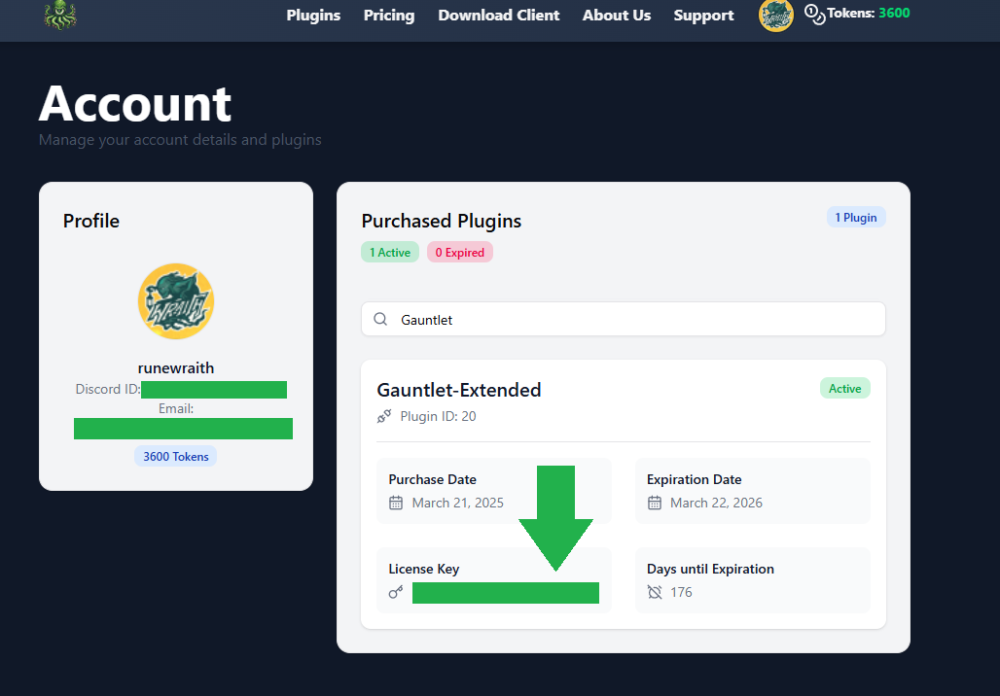
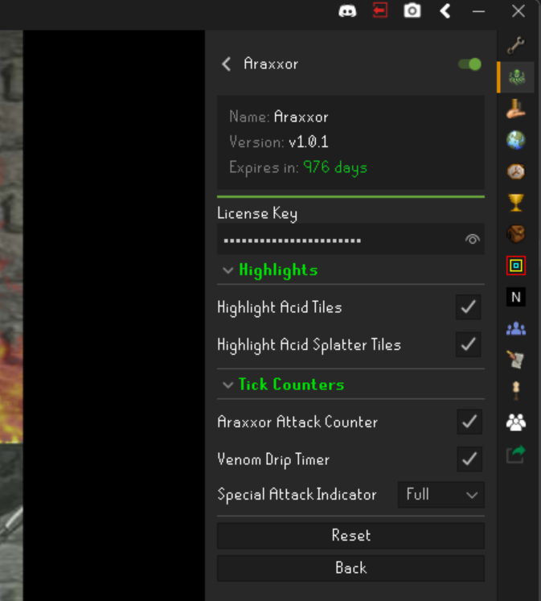
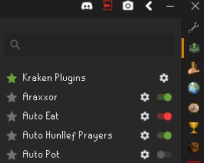

# Plugin Licensing

When you purchase a plugin on Kraken plugins with tokens you will be granted a license to use the plugin for a specified
amount of time. Licensing is a security measure to ensure that you are the only person using the plugins you purchased.

This measure protects both you and Kraken plugins.

## Viewing License Keys

Your license will be viewable right after your purchase a plugin in the "License Key" field as seen below.

If you lose or misplace your license key you can always view it permanently on your [profile page](https://kraken-plugins.com/profile).

## Using License Keys

Every Kraken plugin will have a "License Key" field in its configuration. Copy and paste the license key from your respective
plugin into the license key field in the plugin configuration as shown below.

Plugins will show up :green_heart: **green** in the plugin list sidebar when the license keys are correct and the plugin is active,
:red_circle: **red** when the license key is incorrect and :white_circle: **grey** when they are turned off and disabled.

