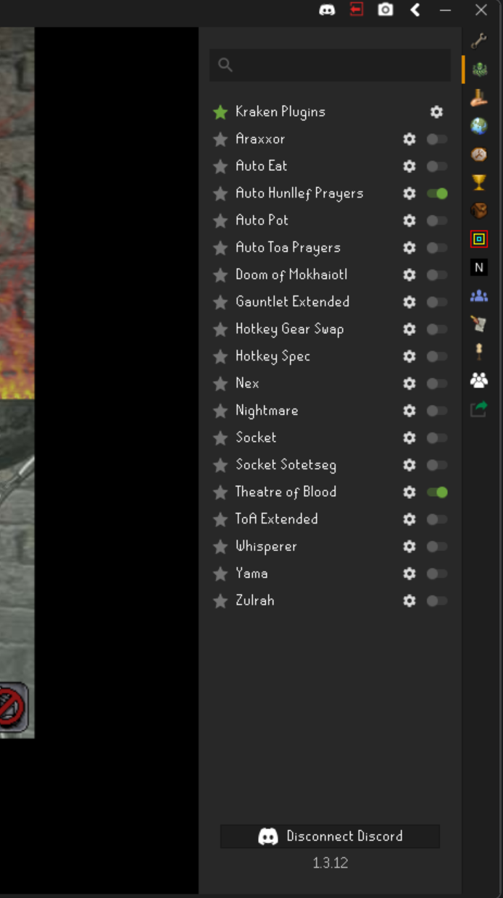
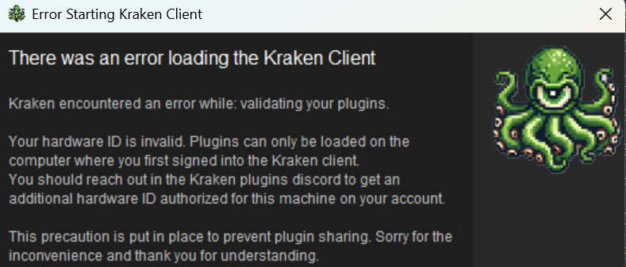

# Plugins

Kraken plugins work and load just like any other standard RuneLite plugins. You will find all of your Kraken plugins
within the Kraken icon in RuneLite's sidebar.

Plugins are updated regularly to include bug fixes and improvements and to stay compatible with game updates. You can
find a full list of plugins, configuration, and demo videos at [kraken-plugins.com/plugins](https://kraken-plugins.com/plugins).

## Plugin List

You can find a list of all our plugins here:

| Plugin Name               | Description                                                                                                                                                                                                   |
|---------------------------|---------------------------------------------------------------------------------------------------------------------------------------------------------------------------------------------------------------|
| Chambers Helper           | Tracks Olm rotations, specials, tick counters, and various boss helpers for CoX.                                                                                                                              |
| Theatre of Blood          | All in one plugin for Theatre of Blood. Maiden attack ticks, Nylo menu entry swaps, aggressive nylo highlights, bloat timers, Sote prayer and maze overlay, tick eat timers, Verzik crab identifier and more! |
| Gauntlet Extended         | Additional helpers for the gauntlet and corrupted gauntlet tracking hunleff prayer and attacks. Resource highlights, demi-boss highlights, resource tracking and more.                                        |
| Sol Heredit Helper        | Shows the safe tiles for Spear and Shield attacks, auto handles grapple and combo special attacks, highlights molten sand and sand beams, and more!                                                           |
| Zulrah                    | Tracks Zulrah rotations, snakelings, where to stand, where to move, and what to pray.                                                                                                                         |
| Nightmare of Ashihama     | All in one plugin for Nightmare and Phosani's Nightmare which tracks prayers, parasites, special attacks, pillar health and more.                                                                             |
| Alchemical Hydra          | Tracks your prayers, special attacks and when to switch for Hydra including the enrage phase. This plugin has markers for acid, fire and lightning.                                                           |
| Vorkath                   | Tracks acid, woox walk paths, and vorkaths special attack count.                                                                                                                                              |
| Cerberus                  | Tracks ghosts, Cerberus prayer rotations, and more.                                                                                                                                                           |
| Effect Timers             | Tracks freeze, teleblock, and other timers!                                                                                                                                                                   |
| Tombs of Amascut Extended | A plugin for Tombs of Amascut with extended features like overlays for: prayers, graphics, counters, entity hiding, and boss mechanics.                                                                       |
| Inferno                   | Timers, NPC overlays, prayer overlays and more for your Inferno grind!                                                                                                                                        |
| Nex                       | Timers, Overlays, prayers, counters, cough tracker and more for Nex!                                                                                                                                          |
| Grotesque Guardians       | Timers, Overlays, prayers, counters, and more for the Grotesque Guardians slayer boss!                                                                                                                        |
| Zalcano Extended          | Overlays, counters, and advanced pathfinding for Zalcano!                                                                                                                                                     |
| Smithing Helper           | potato mode for easy smithing!                                                                                                                                                                                |
| Socket Sotetseg           | Extended plugin handler for Sotetseg in the Theatre of Blood.                                                                                                                                                 |
| Hueycoatl                 | All in one plugin for Hueycoatl, prayers, tick timers, highlights and more!                                                                                                                                   |
| Perilous Moons            | All in one plugin for Perilous moons including tick timers, highlights, special attack helpers and more for each boss!                                                                                        |
| Scurrius                  | All in one plugin for Scurrius the Rat King. Prayer overlays, highlights, tick timers for rubble and more!                                                                                                    |
| Dagannoth Kings           | All in one plugin for the Dagannoth Kings. Includes highlights, overlays, tick counters, prayers and more!                                                                                                    |
| Vetion                    | All in one plugin for Vetion and Calvarion. Includes highlights, overlays, tick counters and more!                                                                                                            |
| Tormented Demons          | All in one plugin for Tormented demons with a tick counter for the bind and fireball highlights!                                                                                                              |
| Duke Helper               | All in one plugin for Duke Succellus showing lightning highlights, vent timers, duke attack ticks, extremity ticks and more!                                                                                  |
| Fight Caves               | Displays current and upcoming wave monsters in the Fight Caves and what to pray at TzTok-Jad                                                                                                                  |
| Araxxor                   | Timers, Overlays and more for swiftly dealing with this spidery slayer boss!                                                                                                                                  |
| Yama                      | All in one plugin for Yama including tick counters, highlights and more! Never struggle with P3 fireballs, judges, or void flares again!                                                                      |
| Auto Scurrius Prayers     | Automatically prays against Scurrius ranged and mage attacks for you!                                                                                                                                         |
| Whisperer                 | Helpers, prayer widgets, and highlights for Whisperers auto and special attacks. This plugin makes Whisperer a breeze and is a must have for any Whisperer runner!                                            |
| Auto Hunllef Prayers      | Automatically prays against Hunllef ranged and mage attacks for you!                                                                                                                                          |
| Hotkey Gear Swap          | Add hotkeys to instantly swap between different gear sets. Add up to 10 custom gear sets and add delays for human like gear swapping.                                                                         |
| Doom of Mokhaiotl         | Overlays, auto prayers, highlights, tick counters and more for the Doom of Mokhaiotl boss. This plugin makes Doom a breeze and is a must have for any Doom runner!                                            |
| Auto Hydra Prayers        | Automatically prays against the Alchemical Hydra's range and mage auto attacks.                                                                                                                               |
| God Wars Helper           | Automatically prays against the minion and boss attacks for all 4 GWD bosses. This plugin includes helpful overlays, timers, and tick counters as well for all 4 bosses.                                      |
| Auto TOA Prayers          | Automatically prays against Zebak and Wardens (P2/P3/Enrage) for you! You have enough to worry about on the last row, let us handle the prayers!                                                              |
| One Click                 | A helpful utility plugin which performs 2 actions in 1 click. This makes actions like chiseling dark essence or fletching darts extremely easy!                                                               |
| Hotkey Spec               | Automatically enables your spec with specific hotkeys or when you setup triggers and equip gear.                                                                                                              |
| Auto Nightmare Prayers    | Automatically prayers against the Nightmare and Phosani's ranged, mage, and melee auto attacks. Supports configurable prayer timings and 1 tick options!                                                      |
| Auto Potion Drinker       | Automatically drinks potions for you! Support combat potions, energy, prayer, range, magic and antipoison/venom.                                                                                              |
| Auto Eat                  | Automatically eats food for you. Supports single eats, wines, combo eats, and triple eats with brews!                                                                                                         |
| Auto Yama Prayers         | Automatically prayers offensively and defensively against Yama. This plugin also has some gear swapping automation for the Judge phases!                                                                      |

## Licenses

Kraken plugins require licenses to activate. Read more about [licensing here](license.md).

## Hardware Locks

Kraken's plugins all implement a Hardware-ID (HWID) locks. This means that when you sign in to the Kraken client for the first time
a unique Hardware ID will be generated based on your motherboard, CPU, GPU, and operating system. This ID is used to lock your
discord account to your specific computer. This is a security precaution put in place to prevent account and plugin sharing.

If you try to log in to your account from another machine (a laptop or friends computer for example) you may receive this message:

which simply means your hardware ID is locked to another device and your plugin will not load. You can reach out to the [kraken support channel](../support/contact.md) in
Discord for help getting additional hardware ID's added or reset.