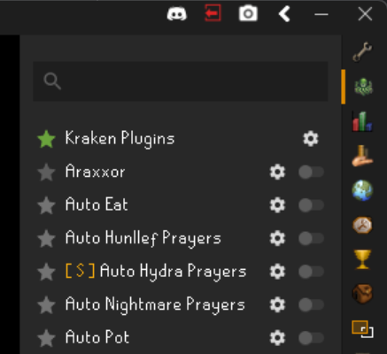

# Third Party & Sideloaded Plugin Policy

Sideloaded 3rd party plugins are plugins which have been created by other plugin developers and are open source. Often times these open source
repositories can be neglected and may not work on the latest version of the RuneLite API. It's like an old rusty engine, sometimes it takes a little
grease and effort to restore the plugins and get them running again! Some examples of 
third party plugin repositories include:

- [Kotori Plugins](https://github.com/OreoCupcakes/kotori-plugins)
- [Lucid Plugins](https://github.com/lucid-plugins/SideloadPlugins)
- [XKylee Plugins](https://github.com/xKylee/plugins-source)
- [Piggy Plugins](https://github.com/rvazarkar/PiggyPlugins/tree/master)
- [Ganom Plugins](https://github.com/Ganom/ExternalPlugins)

Sideloaded 3rd party plugins are different from [external plugins](external.md). The Kraken client supports external plugins which may
be private but are compatible with both the Kraken and RuneLite API's. External plugins differ from sideloaded plugins 
in that they may be paid or maintained by a third party developer and may not be open source, therefore, you won't
have access to third party JAR files to sideloaod. However, they can still be run on the Kraken client.

> :warning: These plugins are open source but are **NOT** vetted to work or be 100% safe to use with Kraken plugins **so be warned**.

The Kraken client does support the use of **some** third party plugins with several conditions:

- The plugin must be completely compatible with RuneLite. Plugins/Scripts for other macro or automation providers like Dreambot, Color bots or AHK Scripts are completely off the table
- If the plugin does use external dependencies (like `PacketUtils`, `Guice Multibindings`, `Apache Commons` etc...) they must be packaged in a "Fat" JAR alongside the plugin classes
  There is no guarantee that the dependencies required by your third party plugin are on the runtime classpath for the Kraken client. The only exception is if the
  Third party plugin uses only the RuneLite API (i.e. overlays only no automation).

## Sideloading Plugins

To sideload plugins add the plugin JAR files to the `~/.runelite/kraken/sideloaded-plugins` directory on your MacOS or Windows system.
If the directory does not exist, create it or run the client, and the directory will be created automatically. If the plugin 
is compatible with Kraken, it will be loaded on the next client restart and you will see it denoted by a yellow `[ S ]` 
in the client plugins panel. This means that the plugin is a third-party plugin and was sideloaded.

## Troubleshooting

Launch RuneLite in safe mode using the following command: `"%localappdata%\runelite\runelite.exe" --safe-mode`

This temporarily disables all 3rd party plugins, which will allow you to confirm if the issue is caused by a 3rd party plugin and isn't a core RuneLite issue.
If the issue is caused by a 3rd party plugin, you should isolate which plugin it is and then uninstall the plugin.

### Logs

You can also check the client logs in `~/.runelite/logs/client.log` and upload them to [Kraken Support](https://kraken-plugins.com/support) 
to get some help in resolving issues. There is no guarantee that Kraken will be able to fully support all your third party plugins but sometimes
the issue is simple and can get you unblocked and playing quickly!