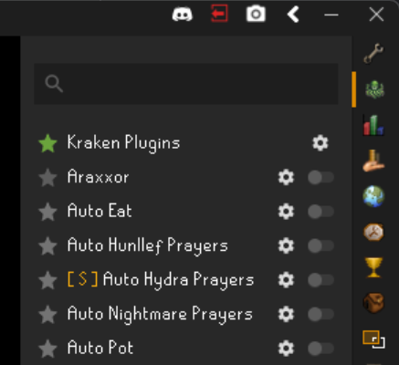

# Third Party & Sideloaded Plugin Policy

Third party plugins are plugins which have been created by other plugin developers and are open source. Some examples of 
third party plugin repositories include:

- [Kotori Plugins](https://github.com/OreoCupcakes/kotori-plugins)
- [Lucid Plugins](https://github.com/lucid-plugins/SideloadPlugins)
- [XKylee Plugins](https://github.com/xKylee/plugins-source)
- [Piggy Plugins](https://github.com/rvazarkar/PiggyPlugins/tree/master)
- [Ganom Plugins](https://github.com/Ganom/ExternalPlugins)

> :warning: These plugins are open source but are **NOT** vetted to work or be 100% safe to use with Kraken plugins **so be warned**.

The Kraken client does support the use of **some** third party plugins with several conditions:

- The plugin must be completely compatible with RuneLite. Plugins/Scripts for other macro or automation providers are completely off the table
- If the plugin does use external dependencies (like `PacketUtils`, `Guice Multibindings`, `Apache Commons` etc...) they must be packaged in a "Fat" JAR alongside the plugin classes
  There is no guarantee that the dependencies required by your third party plugin are on the runtime classpath for the Kraken client. The only exception is if the
  Third party plugin uses only the RuneLite API (i.e. overlays only no automation).

## Sideloading Plugins

In order to sideload plugins add the plugin JAR files to the `~/.runelite/sideloaded-plugins` directory on your MacOS or Windows system.
If the directory does not exist simply create it. If the plugin is compatible with Kraken it will be loaded on the next client restart 
and you will see it denoted by a yellow `[ S ]` in the client plugins panel. This means that the plugin is a third party plugin and was 
sideloaded.

## Troubleshooting

Launch RuneLite in safe mode using the following command: `"%localappdata%\runelite\runelite.exe" --safe-mode`

This temporarily disables all 3rd party plugins, which will allow you to confirm if the issue is caused by a 3rd party plugin and isn't a core RuneLite issue.
If the issue is caused by a 3rd party plugin, you should isolate which plugin it is and then uninstall the plugin.

You can also check the client logs in `~/.runelite/logs/client.log` and upload them to [Kraken Support](https://kraken-plugins.com/support) 
to get some help in resolving issues. There is no guarantee that Kraken will be able to fully support all your third party plugins.