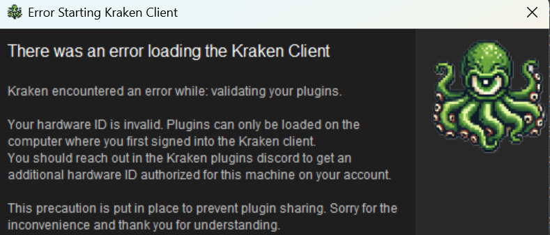

# Requirements

Kraken plugins has some basic requirements before you can start using them namely being RuneLite and Java. You can read
more about Kraken's requirements below.

## OS Requirements
Kraken is supported on the following operating
systems:

- Windows (Preferred)
- MacOS

Windows is the preferred OS as that is how plugins are tested and developed however,
there is a JAR file client for MacOS as well.

## Installing RuneLite

Kraken is built on top of RuneLite and assumes that you have the [RuneLite](https://runelite.net) Old School RuneScape client already installed.

If you have not yet installed [RuneLite](https://runelite.net) visit [RuneLite.net](https://runelite.net) and click
the yellow "Download" button to download the executable (`.exe`) file. Click the executable and follow the prompts to
install RuneLite.

## Hardware Requirements

Kraken is fairly lightweight and so the hardware requirements align closely with RuneLite's. Keep in mind that 

### Minimum Hardware
- Windows 10 or macOS 10.15+
- 2GB RAM
- Java 11 or higher
- 75MB free disk space

### Recommended Hardware
- Dedicated GPU (to use RuneLite's GPU plugin) this makes the game significantly more performant
- Windows 11 or macOS 12+
- 4GB RAM
- Java 17 or higher
- 1GB free disk space

## Hardware Locks

Kraken's plugins all implement a Hardware-ID (HWID) lock. This means that when you sign in to the Kraken client for the first time 
a unique Hardware ID will be generated based on your motherboard, CPU, GPU, and operating system. This ID is used to lock your
discord account to your specific computer. This is a security precaution put in place to prevent account and plugin sharing.

If you try to login to your account from another machine (a laptop for example) you may receive this message:

which simply means your hardware ID is locked to another device and your plugin will not load. You can reach out to the [kraken support channel](support/contact.md) in
Discord for help getting additional hardware ID's added or reset.