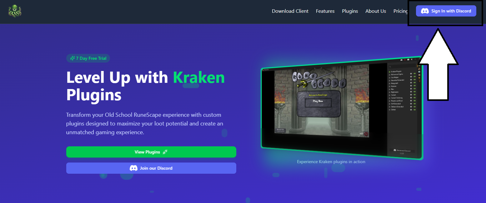

# Signing Up

Kraken plugins user signups are all handled through Discord. If you do not have a discord account you can create one for
free at [Discord.com](https://discord.com/). 

Once you have a Discord account you can click the "Login" with Discord button on the [Kraken Plugins website](https://kraken-plugins.com)
to create your free Kraken account. Creating a Kraken account will give you access to the following additional pages on the website:

- Download Client
- Support
- Profile
- Token Purchasing

When logging in with Discord for the first time it will automatically create your Kraken account for you. Discord is the 
only way to sign in and out of the Kraken client and website.

## Client Signup

When you first launch the client you will see a "Sign in with Discord" button in the Kraken sidebar. Clicking this 
button will open up a new page in your web browser and grant Kraken access to view a few properties on your Discord account
and sign you into the client. Signing in to the client is generally a one time process unless you use multiple discord
account with Krakens although, this is **NOT** recommended.

## Account Linking

It is **VERY** important that you sign in to the same discord account on both the website and the client. When purchasing plugins on the website
your plugins will be associated with the discord account you are currently logged in with. If you sign in to a different discord account on the client
your plugins will **NEVER** show up for you.

Your discord account is the common element between the website and the client so please use the same Discord account when signing
into both the website and the client!